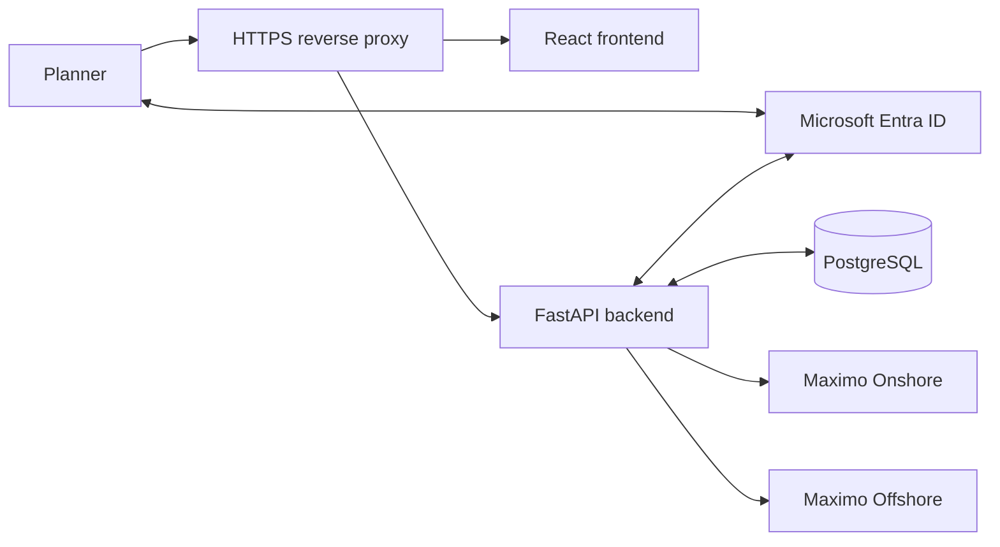

# Kiến trúc Work Order Scheduler

Ngày thiết lập: 2026-09-25. Đây là kiến trúc đích. Foundation và preview giả lập đã chạy local;
SSO/Maximo chưa tích hợp. Xem [trạng thái thực hiện](implementation-status.md) để phân biệt phần đã làm.

## Mục tiêu và quyết định

Thay công cụ Excel VBA bằng web app cho khoảng 10 người dùng đồng thời. Ưu tiên cao nhất
là cập nhật đúng WO, đúng phạm vi quyền và truy vết được người thao tác.

Đã chốt với chủ dự án:
- Frontend/backend tách riêng; React + TypeScript, Python + FastAPI và PostgreSQL là hướng stack.
- Ubuntu đã có Docker; triển khai nội bộ bằng Docker Compose.
- Entra ID SSO; Maximo 7.6.1.3 được gọi bằng tài khoản tích hợp.
- Chấp nhận danh tính tài khoản tích hợp trong Maximo; lưu người thao tác thực tế trên web.
- Planner chỉ xem và sửa discipline được cấp quyền. Quyền gắn với từng hệ thống.
- Onshore và Offshore là hai hệ thống độc lập, không phải hai môi trường test/production.
- Giữ đầy đủ phạm vi chỉnh sửa VBA; có môi trường test, hostname sẽ cung cấp sau.

Các chi tiết như thư viện, phiên bản, server-side session và ba vai trò dưới đây là mặc định
thiết kế để triển khai. Danh sách việc cần xác minh nằm trong [todos.md](todos.md).
Stack và công cụ được duy trì tại [AGENTS.md](../AGENTS.md) và hướng dẫn từng component.

## Sơ đồ

Trình duyệt chỉ gọi backend cùng origin. Backend giữ credential, kiểm tra quyền,
gọi Maximo và lưu lịch sử. PostgreSQL lưu trạng thái ứng dụng; Maximo là nguồn WO chính.
Môi trường test dùng connection riêng được khai báo rõ, không tự động chuyển sang production.

## Bốn phân hệ chính

### 1. Danh tính và phân quyền

Entra SSO dùng authorization-code flow qua backend, thư viện chuẩn và session phía server.
Cookie phiên là Secure/HttpOnly; bảo vệ CSRF cho mutation, kiểm tra state/nonce trong login.
User được định danh bằng tenant ID + object ID, không dùng email làm khóa quyền.

Mỗi access grant gồm người dùng, connection Maximo, discipline và capability.
Vai trò mặc định đề xuất: Viewer chỉ đọc, Planner đọc/sửa/upload, Admin quản lý quyền/cấu hình.
Admin không mặc nhiên được xem WO của mọi discipline.

Quyết định 2026-10-02: connection Onshore test dùng PERSON.ct_discipline làm nguồn grant read.
Backend dùng signed preferred_username trong domain công ty để tìm personid, giữ tenant/object ID
làm identity và binding duy nhất theo connection. Kiểm tra nguồn trước/sau đọc, revoke khi không
xác minh được; null không cấp quyền. Xem [quyền từ PERSON](person-access.md).

Mọi đường đọc đều được giới hạn: danh sách, chi tiết, tìm kiếm, tổng số, bản nháp,
lịch sử và kết quả upload. Các chức năng báo cáo/export sau này phải dùng cùng policy.
Backend áp điều kiện quyền vào truy vấn upstream và kiểm tra kết quả trả về.
Không nhận raw oslc.where, hostname hoặc discipline quyền hạn từ trình duyệt.

Khi quyền bị thu hồi hoặc WO chuyển discipline, bản nháp/cache không được tiếp tục làm
nguồn cấp quyền. Kiểm tra scope hiện tại trước khi cung cấp dữ liệu WO lưu cục bộ;
nếu không xác minh được thì không trả nội dung. Cần áp dụng quy tắc này nhất quán cho lịch sử.

### 2. Maximo connector và retrieval

Một registry lưu cấu hình connection gồm hệ thống, môi trường, URL, object structure,
timezone và tham chiếu secret. Hai hệ thống có credential và health status độc lập.
Nhận diện bản ghi bằng connection + site + workorderid; WONUM chỉ là mã hiển thị/tìm kiếm.

Bằng chứng từ VBA đã đọc:
- WO endpoint: /maximo/oslc/os/oslcmxwodetail/.
- Crew endpoint: /maximo/oslc/os/mxpersongroup/.
- Open statuses: APPR, SCHED, WMATL, WMAT, DFAPPR.
- Query dùng discipline, khoảng targcompdate, istask=0 và parent!="*".
- Lấy thêm location, lochierarchy.systemid, priority, progress, PIC và các loại ngày.
- Ghi bằng POST với x-method-override: PATCH, định danh record từ workorderid.

Đây là hợp đồng tham chiếu cần kiểm chứng trên test, không là bằng chứng rằng mọi endpoint,
status domain và quyền của hai hệ thống giống nhau.
Connector phải encode query, xử lý null, phân trang đầy đủ, timeout và lỗi upstream.
Chỉ theo pagination/resource links thuộc connection tin cậy.

### 3. Lập lịch và bản nháp

Luồng: chọn hệ thống/discipline được phép → retrieve → sửa bảng → lưu nháp →
xem before/after → upload dòng được chọn → xem kết quả.

| Trường Maximo | Chức năng | Quy tắc |
|---|---|---|
| schedstart | Scheduled Start | Kiểm tra ngày giờ và quan hệ start/finish |
| schedfinish | Scheduled Finish | Không trước start |
| assignedtechname | Assigned PIC | Kiểm tra danh sách crew hợp lệ |
| estdur | Estimated Duration | Số không âm; xác nhận đơn vị/độ chính xác trên test |
| targstartdate | Target Start | Chỉ gửi khi người dùng chọn đổi target; cấm PM/CFT |
| targcompdate | Target Finish | Cùng quy tắc target; kiểm tra thứ tự ngày |

Không tự thay đổi status, discipline, actual dates hoặc thuộc tính ngoài allowlist.
Chỉ gửi trường có thay đổi và đã được preview; giữ nguyên các giá trị không sửa.
Cần xác minh ý nghĩa ô trống: giữ nguyên hay xóa; chưa cho phép clear cho đến khi chốt hợp đồng.

Ngày giờ phải có timezone nghiệp vụ rõ ràng theo connection. UTC+07 là giá trị dự kiến,
cần xác nhận với test; không dựa vào timezone máy Ubuntu hay máy người dùng.
Với bộ lọc theo ngày, dự kiến dùng đầu ngày đến trước đầu ngày kế tiếp của ngày kết thúc.
Kiểm chứng điều này với dữ liệu thực tế để tránh bỏ sót phần cuối ngày.
Target range và schedule range là hai bộ lọc khác nhau.

### 4. Upload, xung đột và audit

1. Xác thực phiên, quyền hiện tại và scope của từng WO.
2. Đọc lại WO; so sánh revision/giá trị gốc, worktype và discipline.
3. Validate allowlist, PIC, ngày, duration và quy tắc target.
4. Lưu durable audit intent với actor, scope, before/after và attempt ID.
5. Gửi cập nhật có điều kiện theo ETag/If-Match nếu test xác nhận hỗ trợ.
6. Kiểm tra HTTP response và đọc lại các trường đã ghi.
7. Lưu kết quả từng WO, trả tổng số confirmed/failed/conflict/unknown.

Không có transaction nguyên tử giữa PostgreSQL và Maximo. Nếu upstream đã ghi nhưng kết nối
mất hoặc lưu kết quả thất bại, trạng thái phải chờ đối soát, không giả định chưa ghi.
Timeout sau khi gửi là unknown; đọc lại trước khi quyết định có được retry.
Deduplicate thao tác submit và tuần tự hóa cập nhật cùng WO trong ứng dụng.

Kiểm tra read-before-write không tự loại bỏ race với người sửa trực tiếp trên Maximo.
Nếu upstream không hỗ trợ conditional update, phải ghi rõ hạn chế và quyết định cách xử lý
trước production. Một batch có thể thành công một phần; không hứa rollback toàn batch.

Audit là append-only đối với người dùng ứng dụng, lưu người thực tế dù Maximo dùng account
tích hợp. Không lưu token/API key hoặc toàn bộ response không cần thiết vào log.

## Mô hình dữ liệu dự kiến

| Entity | Nội dung |
|---|---|
| User | Entra tenant/object ID, tên hiển thị, trạng thái |
| AccessGrant | User, connection, discipline, capability |
| MaximoConnection | Hệ thống/môi trường, cấu hình công khai và tham chiếu secret |
| Session | Phiên đăng nhập phía server, expiry |
| Draft / DraftItem | Chủ sở hữu, identity WO, scope, baseline, revision và thay đổi |
| UploadBatch / UploadItem | Actor, idempotency key, trạng thái từng WO và attempt |
| AuditEvent | Ý định, kết quả, before/after, người thao tác và correlation ID |

Draft mặc định thuộc người tạo; không tự chia sẻ giữa planner. Schema chi tiết, unique keys,
foreign keys, retention và migration được triển khai trong các đầu việc riêng.
Alembic là nguồn thay đổi schema; review migration trước khi áp dụng.

## Lỗi và cách hiển thị

- 401: chưa đăng nhập/hết phiên.
- 403: thiếu capability cho hành động.
- 404: không tìm thấy hoặc không được phép thấy WO; không tiết lộ tồn tại ngoài scope.
- 409: baseline thay đổi, duplicate đang xử lý hoặc cần đối soát xung đột.
- 422: dữ liệu chỉnh sửa không hợp lệ, gồm target PM/CFT.
- 502/503/504: lỗi upstream/không sẵn sàng/timeout. Với mutation phải kèm trạng thái
  từng item đã lưu, phân biệt thất bại xác định với unknown.
- Lỗi API key Maximo là lỗi integration phía server, không coi là hết phiên Entra của planner.

## Triển khai và vận hành

Một Ubuntu host chạy HTTPS reverse proxy phục vụ frontend, backend và PostgreSQL qua
Docker Compose. Database chỉ mở trong mạng nội bộ container, có volume và backup.
Frontend/backend không phụ thuộc filesystem container để giữ draft hoặc lịch sử.

Backend cần đi tới Entra và các Maximo connection đã cấu hình. Trình duyệt cần truy cập
ứng dụng và Entra; việc đăng nhập phụ thuộc đường mạng tới Entra dù Maximo nằm nội bộ.
DNS, certificate, tenant/app registration, callback URI và secret được cấu hình theo môi trường.
Không tắt TLS verification để bỏ qua chứng chỉ nội bộ; cung cấp CA phù hợp.

Khoảng 10 phiên đồng thời là mục tiêu kiểm thử, không phải số liệu hiệu năng đã đo.
Giới hạn số request upstream song song; theo dõi độ trễ và batch lớn trước khi thêm worker/broker.
Cần backup/restore PostgreSQL, đối soát upload sau restart và quy trình cập nhật credential.

## Tiêu chí bất biến phải có kiểm thử

- Không rò rỉ WO hoặc metadata ngoài scope qua bất kỳ endpoint nào.
- Không nhầm WO giữa hai connection dù trùng WONUM/workorderid.
- Không sửa target PM/CFT hoặc field ngoài allowlist.
- Không gửi mutation khi chưa lưu audit intent.
- Không báo thành công khi chưa xác nhận kết quả; unknown không được tự retry.
- Không đưa credential xuống trình duyệt hoặc vào log.
- Thu hồi quyền và đổi discipline có hiệu lực với cả dữ liệu đang lưu nháp.

## Phạm vi triển khai và phần để sau

Giai đoạn đầu ưu tiên luồng retrieve/edit/upload, lưu nháp, audit, SSO và scope isolation.
Workbook còn có Scheduled WO, crew workload, summary và tiến độ/compliance:
ghi nhận trong backlog giai đoạn sau, không coi đã chuyển đổi toàn bộ workbook.
Gantt, tự tối ưu lịch, thông báo và thay đổi status WO chưa thuộc bản đầu.

Trình tự và tiêu chí nghiệm thu nằm trong [todos.md](todos.md).
